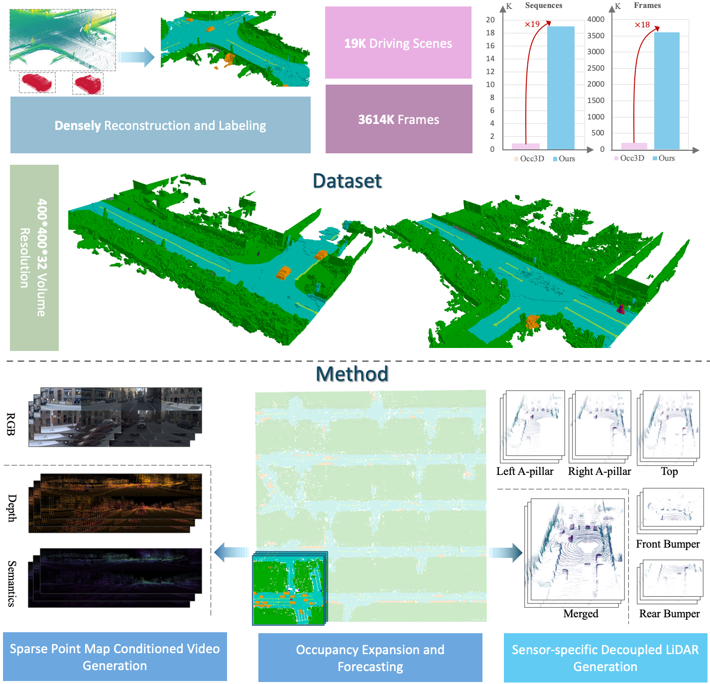
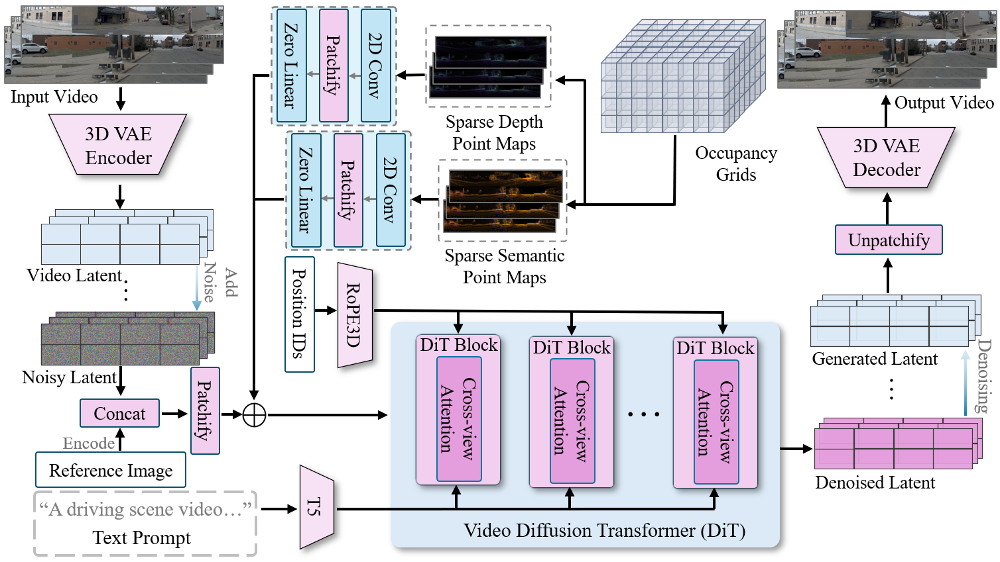
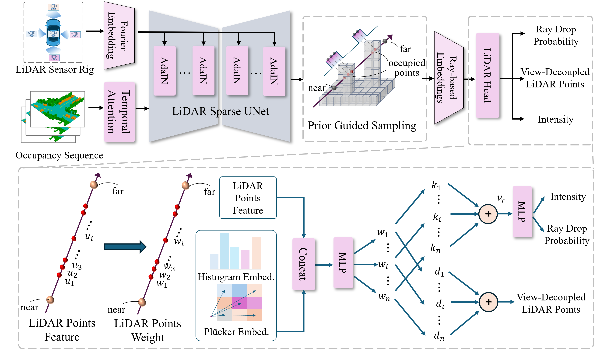
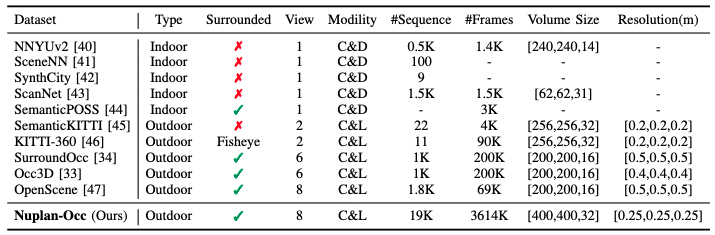
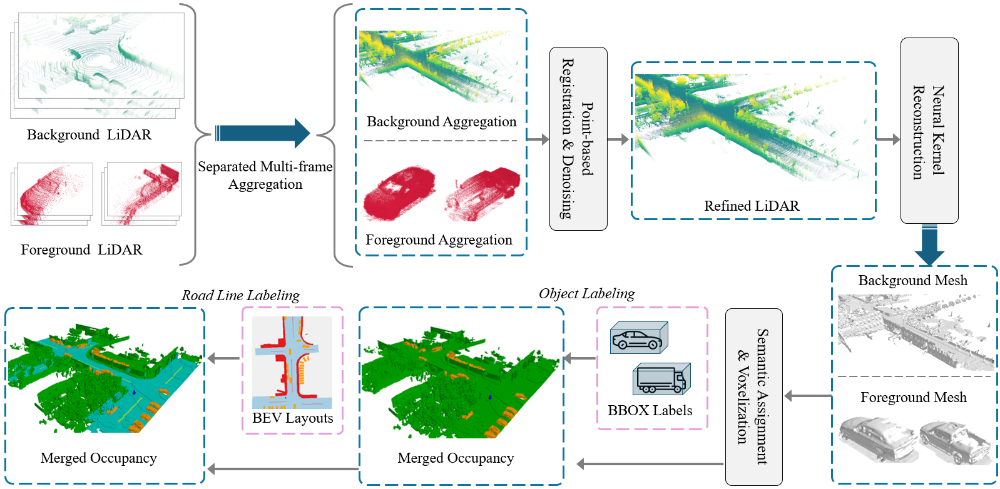

# Scaling Up Occupancy-centric Driving Scene Generation: Dataset and Method (UniScenev2)


[](#-citation)
[](https://arxiv.org/abs/2510.22973) 
[](https://arlo0o.github.io/uniscenev2/)
[](https://huggingface.co/datasets/Arlolo0/Nuplan-Occupancy/tree/main) 
[](#-released-resources)
<!-- [](./assets/UniScene-arxiv.pdf) -->


---
## 📌 Introduction

**UniScenev2** is a unified occupancy-centric framework for large-scale 4D dynamic scene generation in autonomous driving.
This work has been accepted by **IEEE TPAMI 2026**. This repository releases the complete UniScenev2 codebase, including the data processing pipeline, SOP baseline, occupancy generation, video generation, LiDAR generation, and the corresponding dataset/checkpoint download instructions.

We also release [**Nuplan-Occ**](https://huggingface.co/datasets/Arlolo0/Nuplan-Occupancy/tree/main), the largest semantic occupancy dataset to date, built upon the [NuPlan](https://www.nuscenes.org/nuplan) benchmark.

<div align=center></div>

Overview of Nuplan-Occ dataset and the UniScenev2 pipeline. We introduce the largest semantic occupancy dataset to date, featuring dense 3D semantic annotations that contain ~19× more annotated scenes and ~18× more frames than Nuscenes-Occupancy. Facilitated with Nuplan-Occ, UniScenev2 scales up both model architecture and training data to enable high-quality occupancy spatial expansion and temporal forecasting, as well as occupancy-based sparse point map condition for video generation, and sensor-specific LiDAR generation.

---

## 🚀 Released Resources

The `v2` branch now provides the full code, data links, and pretrained checkpoints for UniScenev2.

| Resource | Location | Description |
|----------|----------|-------------|
| Nuplan-Occ dataset | [Hugging Face dataset](https://huggingface.co/datasets/Arlolo0/Nuplan-Occupancy/tree/main) | Occupancy data, pickle metadata, and released checkpoints |
| Data pipeline | [`gs_render`](./gs_render), [`add_bev_layout.py`](./add_bev_layout.py), [`occ_downsample_parallels.py`](./occ_downsample_parallels.py) | NuPlan occupancy generation, downsampling, BEV layout mapping, and rendering utilities |
| SOP baseline | [`SOP/monoscene`](./SOP/monoscene) | MonoScene-based semantic occupancy prediction baseline on Nuplan-Occ |
| Occupancy generation | [`occupancy_generation`](./occupancy_generation) | 3D VAE, occupancy DiT, forecasting, spatial expansion, preprocessing, and visualization |
| Video generation | [`video_generation`](./video_generation) | Multi-view driving video generation from occupancy-aware conditions |
| LiDAR generation | [`lidar_generation`](./lidar_generation) | Occupancy-conditioned LiDAR point cloud generation with OpenPCDet-style code |
| Architecture figures | [`assets`](./assets) | Teaser, data pipeline, and model architecture figures |

### Checkpoints

Download released checkpoints from the Nuplan-Occ Hugging Face dataset:

```text
checkpoint/
├── video_generation/   # video diffusion checkpoint
├── occ_generation/     # 3dvae.pth and dit.pt
└── lidar_generation/   # checkpoint.pth
```

Each generation module includes its own README with the expected local checkpoint layout and runnable entry point:
[`video_generation/README.md`](./video_generation/README.md),
[`occupancy_generation/README.md`](./occupancy_generation/README.md), and
[`lidar_generation/README.md`](./lidar_generation/README.md).

---

## 📚 Method Overview

UniScenev2 follows an occupancy-centric generation pipeline. It first models dynamic 4D semantic occupancy as the shared scene representation, then transfers this representation to sensor-specific outputs, including surround-view video and LiDAR point clouds.

### Occupancy Generation

<div align=center></div>

The occupancy generation branch expands and forecasts semantic occupancy in a structured 4D voxel space. This branch provides the intermediate scene representation used by downstream video and LiDAR generation. Code and instructions are available in [`occupancy_generation`](./occupancy_generation).

### Video Generation

<div align=center></div>

The video generation branch uses occupancy-derived sparse point maps, semantic maps, depth maps, camera parameters, and text conditions to generate temporally coherent multi-view driving videos. The released video code is available in [`video_generation`](./video_generation).

### LiDAR Generation

<div align=center></div>

The LiDAR generation branch transfers semantic occupancy into sensor-specific LiDAR point clouds with geometry-aware and ray-based modeling, enabling generated scenes to be consumed by LiDAR-based perception pipelines. Code and instructions are available in [`lidar_generation`](./lidar_generation).

---

## 🗃️ Nuplan-Occ Dataset

We introduce **[Nuplan-Occ](https://huggingface.co/datasets/Arlolo0/Nuplan-Occupancy/tree/main)**, a large-scale semantic occupancy dataset featuring:

- ✅ **3.6M frames** with dense 3D semantic annotations
- ✅ **High-resolution voxel grids** (400×400×32)
- ✅ **Surround-view** (8 cameras) and **LiDAR** data
- ✅ **Foreground-Background Separate Aggregation (FBSA)** for precise labeling

### 📊 Dataset Comparison

<div align=center></div>

Comparison between Nuplan-Occ and other occupancy/LiDAR datasets. ''Surrounded'' represents surround-view image inputs. ''View'' means the number of image view inputs. ''C'', ''D'', and ''L'' denote camera, depth, and LiDAR, respectively.


---

## 🛠️ Data Pipeline

<div align=center></div>

### 1. Environment Setup

```bash
conda env create -f data_pipeline_env.yaml
conda activate uniscenev2_data_pipeline
```
 
Install dependencies:

```bash
WORK_DIR=YOUR_WORK_DIR
cd $WORK_DIR/gs_render/data_process/nksr
pip install . -v
cd $WORK_DIR/gs_render/data_process/kiss-icp/python
pip install . -v
# Optional: for Gaussian splatting rendering
cd $WORK_DIR/gs_render/diff-gaussian-rasterization
pip install . -v
cd $WORK_DIR/gs_render/gsplat
pip install . -v
```

Place the neural kernel model `ks.pth` in `./ks.pth`.

### 2. Prepare Data

#### a. Download NuPlan Dataset
Download from [NuPlan](https://www.nuscenes.org/nuplan) and place the dataset under `./data/nuplan`:

```
./data/nuplan
└── sensor_blobs
    ├── mini
    └── trainval
```

#### b. Download Pickle Files

Download from [Hugging Face](https://huggingface.co/datasets/Arlolo0/Nuplan-Occupancy/tree/main/pickle) and place the provided pickle files under `./data/nuplan_pkls`:

```
./data/nuplan_pkls
├── mini
│   ├── nuplan_mini_10hz_train.pkl
│   └── nuplan_mini_10hz_val.pkl
└── trainval
    ├── nuplan_trainval_10hz_train_chunk_0_.pkl
    ...
    └── nuplan_trainval_10hz_val.pkl
```

### 3. Run Data Pipeline (Optional)

You can generate occupancy data from scratch:

```bash
# Single GPU
python gs_render/data_process/generate_occ_nuplan.py --save_path $OCC_SAVE_PATH

# Multiple GPUs
torchrun --nproc_per_node=$GPU_NUM gs_render/data_process/generate_occ_nuplan.py --save_path $OCC_SAVE_PATH
```

### 4. Download Preprocessed Data

Download the preprocessed Nuplan-Occ dataset from:  
👉 [Arlolo0/Nuplan-Occupancy on Hugging Face](https://huggingface.co/datasets/Arlolo0/Nuplan-Occupancy/tree/main)

Use `merge_chunk.py` to merge chunks if needed.  
Visualize occupancy with `gs_render/vis_occ/vis_occ.py`.

#### 📝 Note on Z-axis Ranges

| Split | Resolution | Z Range | Config |
|-------|------------|---------|---------|
| Mini train | 800 | -5 ~ 3 | config_nuplan_r800_old |
| Mini val | 800 | -3 ~ 5 | config_nuplan_r800 |
| Trainval train | 400 | -3 ~ 5 | config_nuplan_r400 |
| Trainval val | 400 | -3 ~ 5 | config_nuplan_r400 |

> ⚠️ **Please note**: The z-axis range of **Miniset train** is **-5 to 3**.

### 5. Downsample Occupancy

```bash
python3 occ_process_parallels.py \
  --quantize_size 200 200 16 \
  --data_base_path $OCC_SAVE_PATH \
  --save_base_path $DOWNSAMPLED_OCC_PATH \
  --config_path "gs_render/data_process/nuplan.yaml" \
  --method "max" \
  --workers 64 \
  --pkl_path $PKL_PATH
```

### 6. Map BEV Layout to Occupancy

Refer to `add_bev_layout.py` for mapping BEV layouts to occupancy grids.


## 📋  Run and Evaluate Semantic Occupancy Prediction (SOP) Baseline  

We provide a reproduced baseline using MonoScene trained on NuPlan-Occ miniset, please refer to: 
[MonoScene Baseline for NuPlan-Occ Dataset.](https://github.com/Arlo0o/UniScene-Unified-Occupancy-centric-Driving-Scene-Generation/tree/v2/SOP/monoscene)

---

## 🎨 Rendering

To render Gaussian-based sparse point maps:

Modify paths in `gs_render/run_render_nuplan_mini_val_nomap_r400_ut.sh` and run:

```bash
bash gs_render/run_render_nuplan_mini_val_nomap_r400_ut.sh 0 100000
```

Note: If you want to render the full set or another split, remember to change the corresponding path and config.

---

## 🎬 Video Generation

The UniScenev2 video generation code is integrated under [`video_generation`](./video_generation). The original `pwm` package has been renamed to `uniscenev2`, and pretrained video weights should be downloaded from:
[NuPlan-Occupancy/checkpoint/video_generation](https://huggingface.co/datasets/Arlolo0/Nuplan-Occupancy/tree/main/checkpoint/video_generation).

The released branch includes model code, NuPlan configs, condition-map rendering scripts, and the inference entry point. Please prepare the external VAE and T5 assets under `video_generation/ckpts/` following the official Hugging Face paths described in [`video_generation/README.md`](./video_generation/README.md), then run:

```bash
cd video_generation
bash run.sh
```

For rendering semantic/depth condition maps and more training/inference details, see [`video_generation/README.md`](./video_generation/README.md).

---

## 🧊 Occupancy Generation

The UniScenev2 occupancy generation code is integrated under [`occupancy_generation`](./occupancy_generation). The original experimental `occ_gen_v2` layout has been flattened into a standalone module with configs, datasets, DiT/VAE models, preprocessing utilities, and visualization tools.

Download the released occupancy checkpoints from:
[NuPlan-Occupancy/checkpoint/occ_generation](https://huggingface.co/datasets/Arlolo0/Nuplan-Occupancy/tree/main/checkpoint/occ_generation).

```bash
cd occupancy_generation
huggingface-cli download Arlolo0/Nuplan-Occupancy \
  --repo-type dataset \
  --include "checkpoint/occ_generation/*" \
  --local-dir .
bash run.sh
```

The expected checkpoint layout is `occupancy_generation/checkpoint/occ_generation/{3dvae.pth,dit.pt}`. Prepare NuPlan pickle files, quantized occupancy grids, and BEV layout conditions following [`occupancy_generation/README.md`](./occupancy_generation/README.md).

---

## 📡 LiDAR Generation

The UniScenev2 LiDAR generation code is integrated under [`lidar_generation`](./lidar_generation). It keeps the OpenPCDet-style `pcdet/` package and NuPlan occupancy-to-LiDAR configs, while excluding pretrained weights and compiled CUDA outputs.

Download the released LiDAR checkpoint from:
[NuPlan-Occupancy/checkpoint/lidar_generation](https://huggingface.co/datasets/Arlolo0/Nuplan-Occupancy/tree/main/checkpoint/lidar_generation).

```bash
cd lidar_generation
huggingface-cli download Arlolo0/Nuplan-Occupancy \
  --repo-type dataset \
  --include "checkpoint/lidar_generation/*" \
  --local-dir .
pip install -e . -v
cd pcdet/datasets/nuscenes_occ/utils/dda
pip install . -v
cd ../../../../..
bash run.sh
```

The expected checkpoint layout is `lidar_generation/checkpoint/lidar_generation/checkpoint.pth`. Prepare NuPlan sensor blobs, pickle files, and quantized occupancy grids following [`lidar_generation/README.md`](./lidar_generation/README.md).

---

## 📜 Citation

If you use **UniScenev2** or the **Nuplan-Occ dataset**, please cite our paper:

```bibtex

@article{li2024uniscene,
  title={UniScene: Unified Occupancy-centric Driving Scene Generation},
  author={Li, Bohan and Guo, Jiazhe and Liu, Hongsi and Zou, Yingshuang and Ding, Yikang and Chen, Xiwu and Zhu, Hu and Tan, Feiyang and Zhang, Chi and Wang, Tiancai and others},
  journal={arXiv preprint arXiv:2412.05435},
  year={2024}
}

@article{li2026scaling,
  title={Scaling Up Occupancy-centric Driving Scene Generation: Dataset and Method},
  author={Li, Bohan and Jin, Xin and Zhu, Hu and Liu, Hongsi and Li, Ruikai and Guo, Jiazhe and Cai, Kaiwen and Ma, Chao and Jin, Yueming and Zhao, Hao and others},
  journal={IEEE Transactions on Pattern Analysis and Machine Intelligence},
  year={2026}
}
```

 
---

## ⭐ Star Us!

If you find this project helpful, please give it a ⭐ on GitHub!

 
