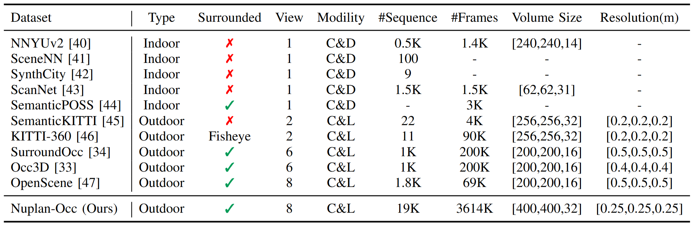

# UniScenev2: Scaling Up Occupancy-centric Driving Scene Generation


 <!-- [](https://arxiv.org/abs/2412.05435)  -->
[](https://arlo0o.github.io/uniscenev2/)
[](https://huggingface.co/datasets/Arlolo0/Nuplan-Occupancy/tree/main) 
<!-- [](./assets/UniScene-arxiv.pdf) -->


---
## 📌 Introduction

**UniScenev2** is a unified occupancy-centric framework for large-scale 4D dynamic scene generation in autonomous driving.
This repository provides the data processing pipeline and the [**Nuplan-Occ**](https://huggingface.co/datasets/Arlolo0/Nuplan-Occupancy/tree/main) dataset, the largest semantic occupancy dataset to date, built upon the [NuPlan](https://www.nuscenes.org/nuplan) benchmark.

<div align=center></div>

Overview of Nuplan-Occ dataset and the UniScenev2 pipeline. We introduce the largest semantic occupancy dataset to date, featuring dense 3D semantic annotations that contain ~19× more annotated scenes and ~18× more frames than Nuscenes-Occupancy. Facilitated with Nuplan-Occ, UniScenev2 scales up both model architecture and training data to enable high-quality occupancy spatial expansion and temporal forecasting, as well as occupancy-based sparse point map condition for video generation, and sensor-specific LiDAR generation.

---

## 🗃️ Nuplan-Occ Dataset

We introduce **[Nuplan-Occ](https://huggingface.co/datasets/Arlolo0/Nuplan-Occupancy/tree/main)**, a large-scale semantic occupancy dataset featuring:

- ✅ **3.6M frames** with dense 3D semantic annotations
- ✅ **High-resolution voxel grids** (400×400×32)
- ✅ **Surround-view** (8 cameras) and **LiDAR** data
- ✅ **Foreground-Background Separate Aggregation (FBSA)** for precise labeling

### 📊 Dataset Comparison

<div align=center></div>

Comparison between Nuplan-Occ and other occupancy/LiDAR datasets. ''Surrounded'' represents surround-view image inputs. ''View'' means the number of image view inputs. ''C'', ''D'', and ''L'' denote camera, depth, and LiDAR, respectively.


---

## 🛠️ Data Pipeline

### 1. Environment Setup

```bash
conda env create -f data_pipeline_env.yaml
conda activate uniscenev2_data_pipeline
```

Install dependencies:

```bash
WORK_DIR=YOUR_WORK_DIR
cd $WORK_DIR/gs_render/data_process/nksr
pip install . -v
cd $WORK_DIR/gs_render/data_process/kiss-icp/python
pip install . -v
# Optional: for Gaussian splatting rendering
cd $WORK_DIR/gs_render/diff-gaussian-rasterization
pip install . -v
cd $WORK_DIR/gs_render/gsplat
pip install . -v
```

Download the neural kernel model `ks.pth` and place it in `./ks.pth`.

### 2. Prepare Data

#### a. Download NuPlan Dataset

Place the dataset under `./data/nuplan`:

```
./data/nuplan
└── sensor_blobs
    ├── mini
    └── trainval
```

#### b. Download Pickle Files

Place the provided pickle files under `./data/nuplan_pkls`:

```
./data/nuplan_pkls
├── mini
│   ├── nuplan_mini_10hz_train.pkl
│   └── nuplan_mini_10hz_val.pkl
└── trainval
    ├── nuplan_trainval_10hz_train_chunk_0_.pkl
    ...
    └── nuplan_trainval_10hz_val.pkl
```

### 3. Run Data Pipeline (Optional)

You can generate occupancy data from scratch:

```bash
# Single GPU
python gs_render/data_process/generate_occ_nuplan.py --save_path $OCC_SAVE_PATH

# Multiple GPUs
torchrun --nproc_per_node=$GPU_NUM gs_render/data_process/generate_occ_nuplan.py --save_path $OCC_SAVE_PATH
```

### 4. Download Preprocessed Data

Download the preprocessed Nuplan-Occ dataset from:  
👉 [Arlolo0/Nuplan-Occupancy on Hugging Face](https://huggingface.co/datasets/Arlolo0/Nuplan-Occupancy/tree/main)

Use `merge_chunk.py` to merge chunks if needed.  
Visualize occupancy with `gs_render/vis_occ/vis_occ.py`.

#### 📝 Note on Z-axis Ranges

| Split | Resolution | Z Range |
|-------|------------|---------|
| Mini train | 800 | -5 ~ 3 |
| Mini val | 800 | -3 ~ 5 |
| Trainval train | 400 | -3 ~ 5 |
| Trainval val | 400 | -3 ~ 5 |

> ⚠️ **Please note**: The z-axis range of **Miniset train** is **-5 to 3**.

### 5. Downsample Occupancy

```bash
python3 occ_process_parallels.py \
  --quantize_size 200 200 16 \
  --data_base_path $OCC_SAVE_PATH \
  --save_base_path $DOWNSAMPLED_OCC_PATH \
  --config_path "gs_render/data_process/nuplan.yaml" \
  --method "max" \
  --workers 64 \
  --pkl_path $PKL_PATH
```

### 6. Map BEV Layout to Occupancy

Refer to `add_bev_layout.py` for mapping BEV layouts to occupancy grids.

---

## 🎨 Rendering

To render Gaussian-based sparse point maps:

Modify paths in `gs_render/run_render_nuplan_mini_val_nomap_r400_ut` and run:

```bash
bash gs_render/run_render_nuplan_mini_val_nomap_r400_ut.sh 0 100000
```


---

## 📜 Citation

If you use **UniScenev2** or the **Nuplan-Occ dataset**, please cite our paper:

```bibtex
@article{li2024uniscene,
  title={UniScene: Unified Occupancy-centric Driving Scene Generation},
  author={Li, Bohan and Guo, Jiazhe and Liu, Hongsi and Zou, Yingshuang and Ding, Yikang and Chen, Xiwu and Zhu, Hu and Tan, Feiyang and Zhang, Chi and Wang, Tiancai and others},
  journal={arXiv preprint arXiv:2412.05435},
  year={2024}
}
```

 
---

## ⭐ Star Us!

If you find this project helpful, please give it a ⭐ on GitHub!

 