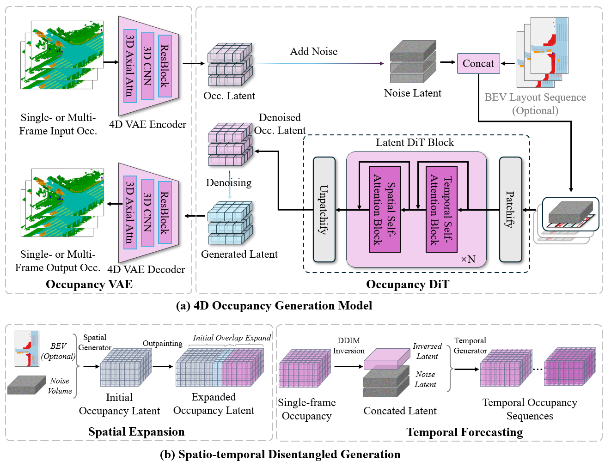

# UniScenev2 Occupancy Generation

This folder contains the occupancy generation branch of UniScenev2. The release keeps the NuPlan-focused generation code, minimal configs, one basic visualization helper, and excludes generated outputs, sample data, and pretrained weights from the repository.

## Framework

<div align=center></div>

The occupancy branch models 4D semantic occupancy as the shared scene representation. It supports high-resolution occupancy forecasting and spatial expansion, and its outputs can be consumed by the video and LiDAR generation branches.

## Directory Layout

```text
occupancy_generation/
├── config/          # minimal VAE / DiT / dataset configs
├── data_preprocess/ # occupancy quantization and BEV mapping helpers
├── dataset/         # NuPlan occupancy datasets and wrappers
├── diffusion/       # DiT diffusion models and sampling utilities
├── loss/            # VAE and occupancy losses
├── model_vae/       # 3D VAE and transformer modules
├── tools/           # minimal train / evaluation entry points
├── utils/           # metrics, loading, visualization helpers
├── visualize/       # basic occupancy visualization helper
├── run.sh           # default high-resolution occupancy inference entry
└── requirements.txt
```

## Installation

Create a Python 3.9/3.10 environment and install dependencies that match your CUDA build.

```bash
cd occupancy_generation
pip install -r requirements.txt
```

`mmcv`, `mmdet3d`, `flash-attn`, and PyTorch CUDA wheels are environment-sensitive. Install the matching wheels for your CUDA and PyTorch versions if the direct `pip install -r requirements.txt` route is not suitable for your machine.

## Pretrained Models

Download the released UniScenev2 occupancy checkpoints from the NuPlan-Occ Hugging Face dataset.

```bash
cd occupancy_generation
pip install -U huggingface_hub
huggingface-cli download Arlolo0/Nuplan-Occupancy \
  --repo-type dataset \
  --include "checkpoint/occ_generation/*" \
  --local-dir .
```

The checkpoints should be placed as:

```text
occupancy_generation/checkpoint/occ_generation/
├── 3dvae.pth
└── dit.pt
```

## Data Preparation

Prepare NuPlan metadata, quantized occupancy grids, and BEV layout conditions.

```text
occupancy_generation/
├── data/
│   ├── nuplan_mini_train_clip_infos_dit.pkl
│   ├── nuplan_mini_val_clip_infos_dit.pkl
│   ├── occ_quan/
│   │   └── nuplan_quantized_400_400_32/
│   └── nuplan_bev_400/
│       └── mini/
```

If you already prepared the UniScenev2 dataset at the repository root, symlink the required files into this folder.

```bash
mkdir -p occupancy_generation/data/occ_quan
ln -s ../../data/nuplan_pkls/mini/nuplan_mini_10hz_val.pkl \
  occupancy_generation/data/nuplan_mini_val_clip_infos_dit.pkl
ln -s /path/to/nuplan_quantized_400_400_32 \
  occupancy_generation/data/occ_quan/nuplan_quantized_400_400_32
ln -s /path/to/nuplan_bev_400/mini \
  occupancy_generation/data/nuplan_bev_400/mini
```

The helper scripts under `data_preprocess/` include occupancy quantization and BEV-to-occupancy mapping utilities. For example:

```bash
cd occupancy_generation/data_preprocess/occ_process
python3 occ_process_parallels.py \
  --quantize_size 400 400 32 \
  --data_base_path /path/to/dense_voxels_with_semantic \
  --save_base_path /path/to/occ_quan \
  --config_path config/nuplan.yaml \
  --method max \
  --workers 16
```

## Inference

The release keeps only the basic NuPlan configs:

- `config/train_3dvae_nuplan_400_full.py`
- `config/train_3dvae_nuplan_400_mini.py`
- `config/train_3dvae_nuplan_200_pro_occ_bev.py`
- `config/save_step2_nuplan.py`
- `config/label_mapping/nuplan-occ.yaml`

Run the default high-resolution occupancy generation demo.

```bash
cd occupancy_generation
bash run.sh
```

Equivalent explicit command:

```bash
torchrun --nproc_per_node 1 --master_port 29502 \
  tools/eval_OccDiT_nuplan_demo_hr_mini.py \
  --ckpt checkpoint/occ_generation/dit.pt \
  --vae_ckpt checkpoint/occ_generation/3dvae.pth \
  --vae_config config/train_3dvae_nuplan_400_full.py \
  --result_dir outputs/occ_generation \
  --imageset data/nuplan_mini_val_clip_infos_dit.pkl \
  --occ-root data/occ_quan/nuplan_quantized_400_400_32 \
  --bev-root data/nuplan_bev_400/mini \
  --lambda_noise_prior 0.3 \
  --cfg-scale 7 \
  --vis \
  --save_occ \
  --inversion
```

## Training

Train the high-resolution occupancy DiT branch with the released VAE checkpoint:

```bash
cd occupancy_generation
torchrun --nproc_per_node 8 --master_port 26342 \
  tools/train_OccDiT_nuplan_400_mini.py \
  --vae_config config/train_3dvae_nuplan_400_mini.py \
  --vae_ckpt checkpoint/occ_generation/3dvae.pth \
  --results-dir outputs/train_occdit_400_mini \
  --imageset data/nuplan_mini_train_clip_infos_dit.pkl \
  --occ-root data/occ_quan/nuplan_quantized_400_400_32 \
  --bev-root data/nuplan_bev_400/mini \
  --dit-batch-size 40
```

## Spatial Expansion

The outpainting utilities support occupancy spatial expansion from an initial frame.

```bash
python outpainting_with_fusion.py \
  --first-frame-path /path/to/first_frame_occ.npy \
  --ckpt checkpoint/occ_generation/dit.pt \
  --vae-ckpt checkpoint/occ_generation/3dvae.pth \
  --vae-config config/train_3dvae_nuplan_200_pro_occ_bev.py \
  --scale-factors 2.0 3.0 4.0 \
  --patch-overlap 0.5 \
  --no-distributed
```

## Acknowledgements

This implementation builds on excellent open-source projects including OccWorld, Occ3D, OpenOccupancy, MMDetection3D, and DiT.
